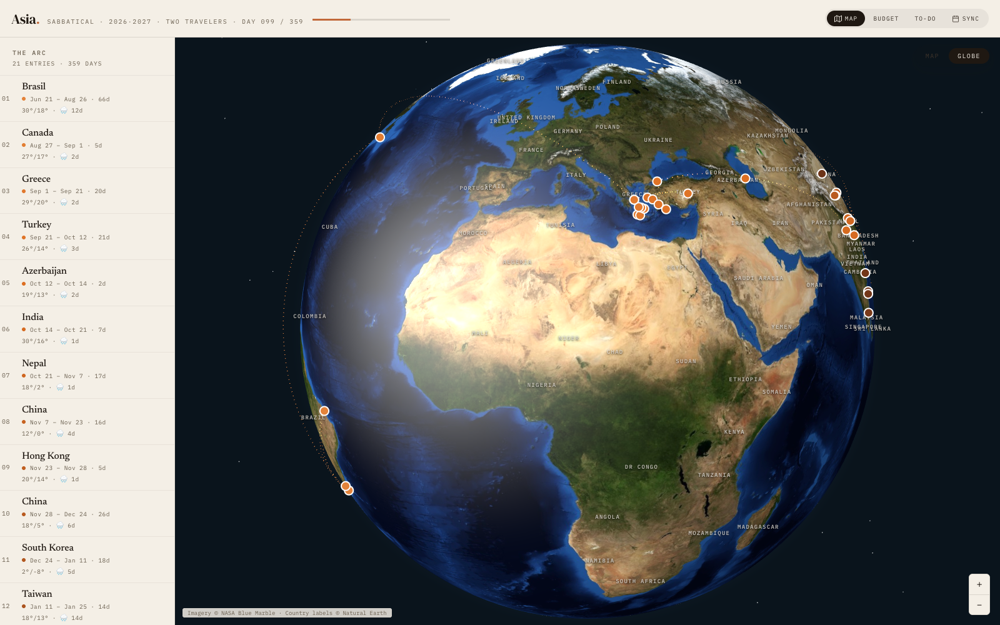

# 🧭 Asia Sabbatical · 2026–2027

*One year. Two travelers. 21 chapters. A carry-on and a backpack each.*



This is the interactive companion to a year-long sabbatical across Asia — part
travel journal, part mission control. It holds the whole arc (Brasil → Canada →
Greece → Türkiye → Azerbaijan → India → Nepal → China → Hong Kong → Korea → Taiwan →
Japan → Indonesia → Borneo → Philippines → Singapore → Malaysia → Thailand →
China, then home), all **359 days** of it, in one page you can spin, click,
budget, and check off.

## What's inside

- 🌍 **A spinnable 3D globe** (plus a flat 2D map for the cartographically
  conservative) with the full route dotted across it — ember-orange, fading
  from sunrise to dark roast as the year goes on.
- 📖 **The Arc** — a chapter rail with every stop, its dates, and its weather
  at a glance. Click one and the globe flies you there.
- 🔍 **Chapter deep-dives** — photo carousels (all local shots, zero
  hotlinking), day-by-day stops, highlights, and the *route decisions* behind
  them, so future-you remembers *why* Folegandros beat Naxos.
- 💰 **A budget binder that does math** — per-chapter sortable table,
  inter-chapter flights, locked costs, contingency, per-day and per-person
  run-rates. Totals compute from the line items; nothing is hardcoded, so the
  numbers can't quietly lie.
- ✅ **A pre-trip checklist** — every flight, stay, visa, and permit that must
  be secured ahead, with book-by dates, overdue highlighting, and an export
  button to commit ticked states back to the file.
- 📅 **Google Calendar sync** — one click pushes chapter date ranges and flight
  blocks to your calendar.
- 🔗 **Shareable views** — every state is a URL
  (`?view=budget&chapter=japan&place=2`), so "look at this" always works.
- 📱 **A real mobile layout** — map/list toggle, bottom-sheet details, thumbable
  everything. Built for hostel Wi-Fi, not just desk demos.
- 🗺️ **One-tap Google Maps** — every stop deep-links straight to the right
  place on the map.

## Run it

It's a static site. Any static server works:

```bash
# from the project directory
python3 -m http.server 8000
# → http://localhost:8000
```

Internet needed on first load (React, Leaflet, Three.js, fonts, map tiles come
from CDNs). Everything trip-specific lives in local files.

## Editing the trip

`itinerary-data.js` is the **single source of truth** — chapters, budget,
flights, bookings, packing. Everything on screen derives from it.

```bash
./build.sh                        # re-compile *.jsx → dist/ after editing components
node scripts/validate-photo-urls.mjs   # check photo keywords resolve
```

Install the pre-commit hook to run the photo check automatically:

```bash
bash scripts/install-pre-commit-hook.sh
```

Practical notes:

- Chapter numbers are **never stored** — `itinerary-store.js` derives them from
  array order, so reordering chapters is renumber-free.
- Todo ticks in the UI live in the browser; use the page's **Export** button to
  copy states back into `todo-data.js` (the durable record) and commit them.
- `calendar-config.js` (gitignored, Google OAuth client ID) is optional — copy
  `calendar-config.example.js` to create it.

## Project structure

| File | What it is |
|---|---|
| `index.html` | Shell — loads CDNs, data, and the compiled app |
| `itinerary-data.js` | 🧠 The trip itself: chapters, budget, flights, bookings |
| `itinerary-geo.js` | Map coordinates per chapter/stop |
| `itinerary-photos.js` | Photo keyword → local `extra-pictures/` mapping |
| `itinerary-store.js` | Read-only view over the data (+ localStorage cache) |
| `app.jsx` | Header, progress bar, deep-linking, mobile switch |
| `map-view.jsx` / `globe-view.jsx` | 2D Leaflet map / 3D Three.js globe |
| `panels.jsx` | Chapter list, detail panel, budget binder |
| `calendar.jsx` | Google Calendar sync (`SyncButton`) |
| `todo.jsx` / `todo-data.js` | Checklist view / its data |
| `extra-pictures/` | All photography, stored locally |
| `dist/` | Pre-compiled JS (checked in so static hosting just works) |
| `reviews/` | Past itinerary review reports (local-only, gitignored) |
| `screenshot.png` | The screenshot up top ☝️ |

## Tech

React 18 (UMD, no bundler in the browser) · Leaflet · Three.js · Babel
pre-compilation via `build.sh` · zero backend — it's a page, not a platform.

---

*Built for two Brazilians with carry-ons, backpacks, and strong opinions about sunsets.*
*If you're reading this from a night train somewhere in Asia: it worked.* 🚂
